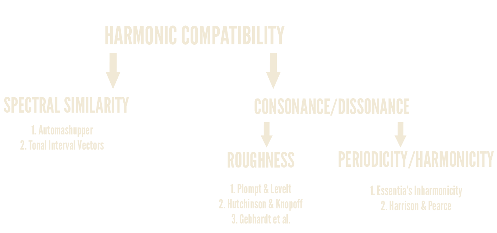

# Harmonic compatibility measures

This repository contains the code used for my Master Thesis _Harmonic Compatibility for loops in electronic music_.

## Algorithms classification


We splitted the package in a similar fashion:

```text
harmonic_compatibility
|
|
------- consonance 
|       |
|       ---------- roughness
|       |          |__________ Plompt & Levelt (pl)
|       |          |__________ Hutchinson & Knopoff (hk)
|       |          |__________ Gebhardt et al. (r_diss)
|       |          |__________ Hutchinson & Knopoff (hk_nocuda)
|       |          |__________ Gebhardt et al. (hk_nocuda)
|       |
|       ---------- harmonicity
|                  |__________ Essentia's Inharmonicity (inharmonicity)
|                  |__________ Harrison & pearce (p_harmon)
|
------- similarity
        |__________ automashupper
        |__________ tiv
|
|
|
------- utils
``` 
The *_nocuda* are versions of the algorithms that *doesn't requiere CUDA* to work. Notice that this versions were
not used in our experiments and still under development. We include those algorithms 

 
## Utils

The utils subpackage contains functions that helps to recreate the methodology used in our work.
The functions allows to mix two audios where both tracks have equal loudness, also has functions that given
a _.csv_ with the compatibilities for one loops, create the top _n_ best mixes. 


## Scripts folder

Here are located the scripts that I used our my work to calculate harmonic compatibility for all the possible algorithms.
They work by setting up different _target loops_, and a directory where all the _candidate loops_ are located.

## Requirements
This repository needs:
* essentia~=2.1b5
* numpy~=1.16.2
* pandas~=0.25.1
* pyrubberband~=0.3.0
* matplotlib~=3.0.2
* setuptools~=41.6.0
* joblib~=0.14.1
* scipy~=1.1.0
* librosa~=0.7.2
* madmom~=0.16.1
* pydub~=0.23.0

And also for _Hutchinson & Knopoff_ and _Gebhardt et al._, CUDA is used to speed up the calculation.
So aditionally for those algorithms you will need:
- CUDA 
- PyCuda (You must install PyCuda according to your CUDA version)

## How to use it

### Harrison & Pearce harmonicity
```python
...
from harmonic_compatibility.consonance.harmonicity import transform_to_pc, ph_harmon, milne_pc_spectrum
from harmonic_compatibility import utils

# Extract the audio of some file
audio_vector = librosa/essentia/madmom...  # Load one track, get its vector of samples
sines_per_frame, magnitudes_per_frame = utils.get_sines_per_frame(audio_vector)  # Get the sines per frame, using the sinusoidal model.

pcs_framewise = utils.transform_to_pc(sines_per_frame) # Transform the sines in Hz to pitch classes
milne_spec = milne_pc_spectrum(pcs_framewise[0]) # Get the Milne's spectrum of the first frame _(see paper for details)_
harmonicity = ph_harmon(milne_spec)
...

```
Notice that with this H&P algorithm calculates the harmonicity, but doesn't calculate the pitch shift that maximises the harmonicity. To do so you have to pitch shift the audio using an algorithm of your preference and use the three steps shown above. 

### Gebhardt et al, Hutchinson & Knopoff dissonance
```python
from harmonic_compatibility.consonance.roughness import gebhardt_dissonance
from harmonic_compatibility.consonance.roughness import hutchinson_dissonance

audio_vector1, audio_vector2 = librosa/essentia/madmom...  # Load the two tracks, and get their vector of samples
ov_g, fwise_g = gebhardt_dissonance(audio_vector1, audio_vector2)  # The overall dissonance and the framewise dissonance.
ov_h, fwise_h = hutchinson_dissonance(audio_vector1, audio_vector2)  # The overall dissonance and the framewise dissonance.
```

In this case this algorithm calculates the roughness across different pitch shifts as in the original paper:
```text
Gebhardt, R., Davies, M., & Seeber, B. (2015). Harmonic mixing based on roughness and pitch commonality.
```
So the `ov` variable will be a list of the form 97x1, which is this the overall dissonance from pitch shift -48 to pitch shift 48.

### Tonal Interval Vectors
```python
from harmonic_compatibility.similarity import TIV, TIVCollection

# beatwise_chroma_x is a numpy array containing a list of chroma vectors for the loop x. Shape: [12 x number of beats]
# chroma_x is just a numpy array containing a chroma vector for the whole loop x. Shape: [12]

TIV_loop_1 = TIV.from_pcp(chroma_1)
TIV_loop_2 = TIV.from_pcp(chroma_2)

bTIV_loop_1 = TIVCollection.from_pcp(beatwise_chroma_1)
bTIV_loop_2 = TIVCollection.from_pcp(beatwise_chroma_2)

small_scale_compatibility = TIV_loop_1.small_scale_compatibility(TIV_loop_2)  # Small scale compatibility for a single TIV. No pitch shift
pitch_shift, min_small_scale_comp = TIV_loop_1.get_max_compatibility(TIV_loop_2)  # The best mean small scale compatibility (the lowest value), and the pitch shift that gives that result

beatwise_small_scale_compatibility = bTIV_loop_1.small_scale_compatibility(bTIV_loop_2)  # The mean small scale compatibility for a collection of TIV. No pitch shift
pitch_shift, beat_min_small_scale_comp = bTIV_loop_1.get_max_compatibility(bTIV_loop_2)  # The best mean small scale compatibility (the lowest value), and the pitch shift that gives that result. The pitch shift is a single value across the set of TIVs.
```

### Automashupper
```python
from harmonic_compatibility.similarity import get_mashability
bpm=140  # Our dataset consists on loops of 140bpm
res_mash, p_shift, b_offset, h_contr, r_contr = get_mashability("path/to/audio1", "path/to/audio2", bpm, bpm, sr=44100)  # Get the mashability

```
`res_mash` maximum mashability score possible for this mix. `p_shift` is the pitch shift that maximizes the compatibility between the two loops. `b_offset` its the beat offset that maximizes the mahsability score. `h_contr` and `r_contr` are the separated values for _harmonic matching_ and _spectral balance_.
